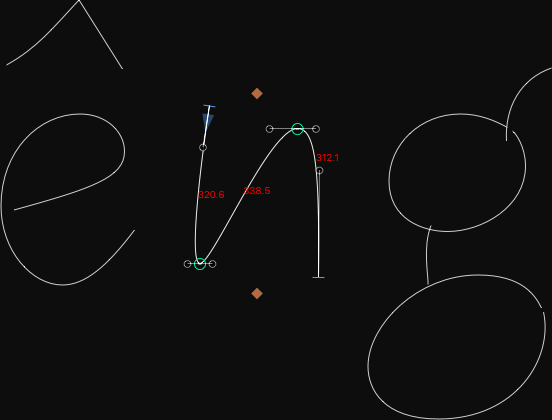

# SegmentLength

*View > Show Segment Lengths* displays the approximate lengths of each path segment of the current glyph in Edit view:

The length of straight line segments is precise, but the displayed lengths of curve segments is a [quick approximation](https://stackoverflow.com/questions/29438398/cheap-way-of-calculating-cubic-bezier-length), idea by [Nic](https://stackoverflow.com/users/615243/nic).

### Installation

1. In *Window > Plugin Manager,* look for *Show Segment Lengths.*
2. Click the *Install* button next to its entry.
3. Restart Glyphs.

### Requirements

The plugin works in Glyphs 2.5 in High Sierra. I can only test it in current app and OS versions, and perhaps it works on earlier versions too.

### License

Copyright 2018 Rainer Erich Scheichelbauer (@mekkablue).
Based on sample code by Georg Seifert (@schriftgestalt) and Jan Gerner (@yanone). 

Licensed under the Apache License, Version 2.0 (the "License");
you may not use this file except in compliance with the License.
You may obtain a copy of the License at

http://www.apache.org/licenses/LICENSE-2.0

See the License file included in this repository for further details.
